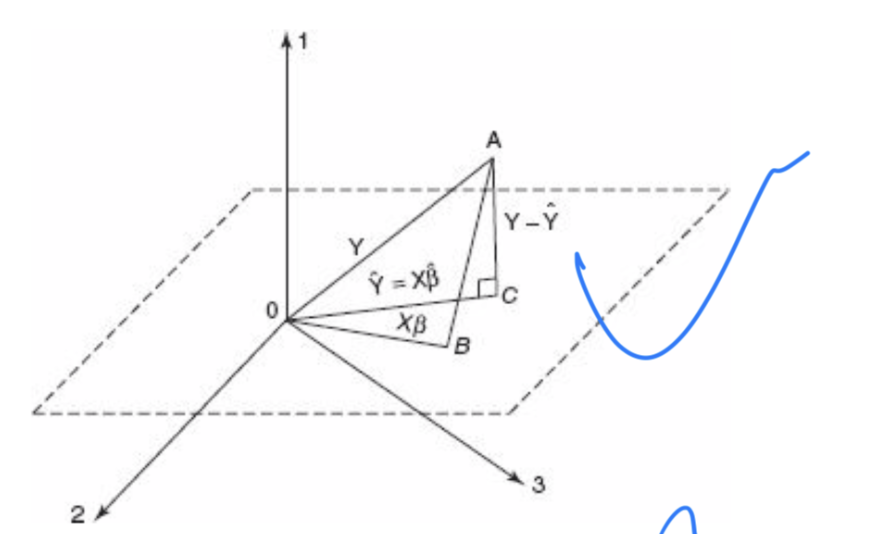

# Regression is very magic

# The space supported by the explanatory variables turns the regression curve into a projection.(由解释变量撑起的空间，回归曲线就变成了投影)--- Prof.Zhu

i.e. $X\hat {\beta}$=$X(X'X)^{-1}X'y$ and this can be also written by firstly "X'(y-X $\hat {\beta})=0$ since we know that y-X $\hat {\beta}$ is perpendicular to the estimation space.

-   relevant to linear algebra too much
