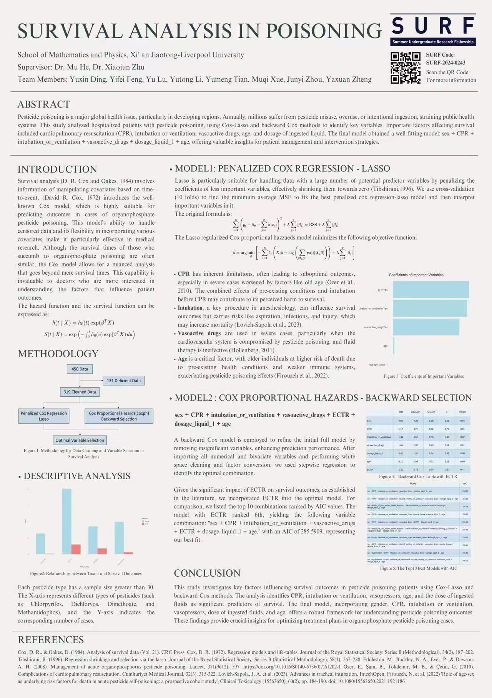
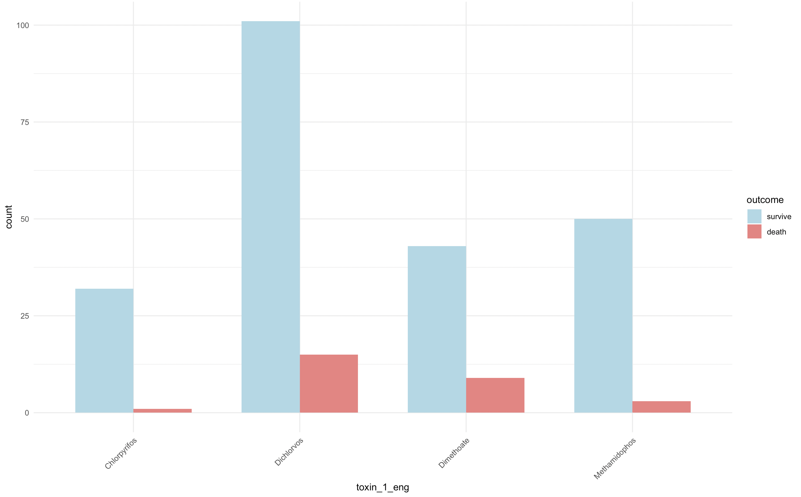
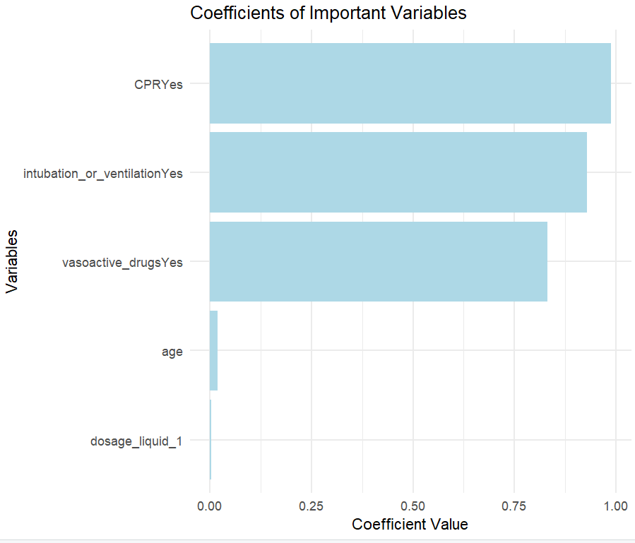

# Abstract

Pesticide poisoning remains a significant public health concern worldwide, particularly in developing regions where regulatory controls are less stringent. Each year, millions of cases arise from the misuse, overuse, or intentional ingestion of pesticides, presenting substantial threats to individual health and imposing significant burdens on public health systems. This study analyzed a cohort of hospitalized pesticide poisoning patients, collecting important demographic, clinical, and biochemical variables. Using the methods of Cox-Lasso and backward Cox, the most relevant variables were identified, analyzed, and interpreted. The findings revealed several important factors related to the survival outcomes of pesticide poisoning cases, including cardiopulmonary resuscitation (CPR), intubation or ventilation, vasoactive drugs, age and the dosage of the ingested liquid, and obtained a well-fitting model: sex + CPR + intubation_or_ventilation + vasoactive_drugs + dosage_liquid_1 + age. These factors are relatively significant in variable selection, providing important insights into patient management and intervention strategies.

# Introduction

Survival analysis (D. R. Cox and Oakes 1984) involves information of manipulating covariates based on time-to-event. (David R. Cox 1972) introduces the well-known Cox model, which is highly suitable for predicting outcomes in cases of organophosphate pesticide poisoning. This model’s ability to handle censored data and its flexibility in incorporating various covariates make it particularly effective in medical research. Although the survival times of those who succumb to organophosphate poisoning are often similar, the Cox model allows for a nuanced analysis that goes beyond mere survival times. This capability is invaluable to doctors who are more interested in understanding the factors that influence patient outcomes.

# Methodology

The flowchart in Figure1 illustrates the methodology for data cleaning and variable selection in survival analysis. Initially, the dataset comprised 450 observations. Following the removal of 131 deficient records, 319 cleaned observations remained. Two modeling approaches were employed to achieve optimal variable selection: Penalized Cox Regression (Lasso) and Cox Proportional Hazards (coxph) with backward selection. These methods were utilized to identify the most significant predictors for survival outcomes, ensuring a robust and accurate analysis.


## Statistical Analysis

The dataset used in this study exclusively comprises organophosphate insecticides. This figure2 presents the survival outcomes for several organophosphate pesticide samples. Each pesticide type has a sample size greater than 30. The X-axis represents different types of pesticides (such as Chlorpyrifos, Dichlorvos, Dimethoate, and Methamidophos), and the Y-axis indicates the corresponding number of cases.



## Model 1: Penalized Cox Regression - Lasso

Lasso is particularly suitable for handling data with a large number of potential predictor variables by penalizing the coefficients of less important variables, effectively shrinking them towards zero (Tibshirani 1996). We use cross-validation (10 folds) to find the minimum average MSE to fix the best penalized cox regression-lasso model and then interpret important variables in it.



**Interpretations of Harmful Variables Identified By Lasso for the Patients Survival:**

1.  CPR : Firstly, CPR has inherent limitations. As E Özer et al. (2010) note, without improved diagnosis and treatment (Eddleston et al. ,2008), CPR can lead to suboptimal outcomes. Secondly, the harm attributed to CPR may stem from patients' severe conditions, often worsened by factors such as old age, which Lasso and Cox models highlight. Additionally,E Özer et al. (2010) mention that intubation or ventilation preceding CPR might increase negative outcomes. Therefore, the combined effects of these factors, rather than CPR alone, make it appear harmful to survival.

2.  intubation_or_ventilation: Intubation refers to the insertion of a plastic tube into the body, usually through the mouth. As one of the cornerstones of anesthesiology, tracheal intubation and ventilation are significant in affecting patients' survival outcomes (Lovich-Sapola, J. A. et al., 2023). However, complications like aspiration, infections, and injury are likely to be caused during intubation, which increase the risk of patient death.

3.  vasoactive_drugs: According to some previous articles, vasoactive drugs are commonly used when the condition of patients is very serious (Wirth and Heidrich, 2012). When the cardiovascular system fails, which is a complication of pesticide poisoning, treatment with vasoactive drugs should commence if the common operation of the fluid therapy does not work(Hollenberg, 2011).

4.  age: Consistent with Firouzeh et al. (2022) , age as an important variable is related to higher risk of death in pesticide intoxication. For instance, older individuals might have preexisting health conditions or a weakened immune system that exacerbates the effects of pesticide exposure.

## Model 2 : Cox Proportional Hazards (coxph) - Backward Selection

**"sex + CPR + intubation_or_ventilation + vasoactive_drugs + ECTR + dosage_liquid_1 + age"**

In Model 2, we adopt backward cox model to gradually remove the insignificant variables from the initial full model, in order to simplify the model and improve the prediction performance. By removing the variables step by step, we find the combination of variables:

``` r
'sex + CPR + intubation_or_ventilation + vasoactive_drugs + dosage_liquid_1 + age'
```

has the best fitting effect and has the smallest AIC of 284.2628.

In detail, we imported all the numerical and bivariate variables in the table, and cox fitted the full model after white space cleaning and factor conversion of the data. The optimal combination is then selected using a simplified stepwise regression model.

Since the literature has proved that ECTR has a significant impact on survival outcomes, we add ECTR to the known optimal model. In order to make a more intuitive comparison, we list the top 10 combinations of AIC values from small to large in the selection process. The combination after joining ECTR ranks 6th. Then we get the model as the following: the variables step by step, we find the combination of variables:

``` r
'sex + CPR + intubation_or_ventilation + vasoactive_drugs + ECTR + dosage_liquid_1 + age'
```

In this variable combination, the AIC is 285.5909. This is the best fit we get.

# Conclusion

This study focuses on exploring the key factors affecting the survival outcomes of pesticide poisoning patients. By employing the method of Cox-Lasso and backward Cox, we effectively identified and analyzed the relevant variables. The results indicate that cardiopulmonary resuscitation (CPR), intubation or ventilation, vasopressors, age, and the dose of ingested fluids are important predictors of survival. The well-fitting model obtained includes gender, CPR, intubation or ventilation, vasopressors, dose of ingested fluids, and age, providing a robust framework for understanding the dynamics of pesticide poisoning outcomes. In summary, these key factors provide important evidence for optimizing treatment plans for patients with organophosphate pesticide poisoning.

# References

Cox, D. R., & Oakes, D. (1984). Analysis of survival data (Vol. 21). CRC Press.

Cox, D. R. (1972). Regression models and life-tables. Journal of the Royal Statistical Society: Series B (Methodological), 34(2), 187–202.

Tibshirani, R. (1996). Regression shrinkage and selection via the lasso. Journal of the Royal Statistical Society: Series B (Statistical Methodology), 58(1), 267–288.

Eddleston, M., Buckley, N. A., Eyer, P., & Dawson, A. H. (2008). Management of acute organophosphorus pesticide poisoning. Lancet, 371(9612), 597. https://doi.org/10.1016/S0140-6736(07)61202-1

Özer, E., Şam, B., Tokdemir, M. B., & Çetin, G. (2010). Complications of cardiopulmonary resuscitation. Cumhuriyet Medical Journal, 32(3), 315-322. Lovich-Sapola, J. A. et al. (2023). Advances in tracheal intubation. IntechOpen. Firouzeh, N. et al. (2022) 'Role of age-sex as underlying risk factors for death in acute pesticide self-poisoning: a prospective cohort study', Clinical Toxicology (15563650), 60(2), pp. 184-190. doi: 10.1080/15563650.2021.1921186

# Appendix

## 1. Codes for Model 1: Penalized Cox Regression - Lasso

``` r
library(glmnet)
library(readxl)
library(dplyr)
library(survival)
library(Hmisc)
library(ggplot2)
data_path <- "/Users/liyutong/Desktop/Book2.xlsx"
train_df <- read_excel(data_path, skip = 1)
set.seed(537)

numeric_vars <- c("dosage_liquid_1", "age")
binary_vars <- c("sex", "mental_health_illness", "hypertension", "history_of_past_mental_health_disease", 
                 "airway", "CPR", "intubation_or_ventilation", "induced_vomiting_or_catharsis", 
                 "vasoactive_drugs", "activated_carbon", "gastric_lavage", "ECTR")


train_df <- train_df %>%
  select(all_of(binary_vars), all_of(numeric_vars), "survival_time", "censor") %>%
  na.omit()

train_df <- train_df %>%
  mutate(across(all_of(binary_vars), as.factor))

cols_with_one_level <- sapply(train_df, function(col) is.factor(col) && length(unique(col)) == 1)
cols_with_one_level_names <- names(cols_with_one_level[cols_with_one_level])
train_df <- train_df %>% select(-one_of(cols_with_one_level_names))
print(cols_with_one_level_names)
x <- model.matrix(~ . - survival_time - censor, data = train_df)[, -1]

y <- Surv(train_df$survival_time, train_df$censor)

# cross-validation for choosing the best lambda
cv_glmnet_fit <- cv.glmnet(x, y, family = "cox", alpha = 1)

best_lambda <- cv_glmnet_fit$lambda.min
cat("Best lambda: ", best_lambda, "\n")
# fix cox+lasoo
glmnet_fit <- glmnet(x, y, family = "cox", lambda = best_lambda)
glmnet_coef <- coef(glmnet_fit)
glmnet_coef <- data.frame(
  coef = rownames(glmnet_coef),
  value = as.vector(glmnet_coef),
  stringsAsFactors = FALSE
)

non_zero_coef <- glmnet_coef %>% filter(value != 0)
print(non_zero_coef)
# C-index(rcorr.cens package uses 1-c_index for printing)
risk_scores <- predict(glmnet_fit, newx = x, type = "link")
c_index <-1- rcorr.cens(risk_scores, y)["C Index"]

cat("C-index: ", c_index, "\n")
# plot
ggplot(non_zero_coef, aes(x = reorder(coef, value), y = value)) +
  geom_bar(stat = "identity", fill = "steelblue") +
  coord_flip() +
  labs(title = "Coefficients of Important Variables",
       x = "Variables",
       y = "Coefficient Value") +
  theme_minimal()
```

## 2. Codes for Model 2 : Cox Proportional Hazards (coxph) - Backward Selection

``` r
# 加载必要的包
library(readxl)
library(dplyr)
library(survival)  # 用于Cox回归模型
library(Hmisc)  # 用于计算C-index

# 读取数据
data <- read_excel("/Users/liyutong/Desktop/Book2.xlsx", skip = 1)

# 定义新的数值变量和二值变量
numeric_vars <- c("dosage_liquid_1", "age")
binary_vars <- c("sex", "mental_health_illness", "hypertension", "history_of_past_mental_health_disease", 
                 "airway", "CPR", "intubation_or_ventilation", "induced_vomiting_or_catharsis", 
                 "vasoactive_drugs", "activated_carbon", "gastric_lavage", "ECTR")

# 转换二值变量并确保其他变量为数值型
#data[binary_vars] <- lapply(data[binary_vars], function(x) as.numeric(as.factor(x)) - 1)
data$censor <- as.numeric(data$censor)

# 确保数值型变量为数值型
data[numeric_vars] <- lapply(data[numeric_vars], as.numeric)
data[binary_vars] <-lapply(data[binary_vars], as.factor)
str(data)
# 去除包含缺失值的行
data <- na.omit(data[, c("survival_time", "censor", binary_vars, numeric_vars)])

# 全模型公式
full_formula <- as.formula(paste("Surv(survival_time, censor) ~", paste(c(binary_vars, numeric_vars), collapse = " + ")))

# 拟合全模型
full_model <- coxph(full_formula, data = data)

# 使用后向逐步回归简化模型
backward_model <- step(full_model, direction = "backward")

# 算c_index
summary_model <- summary(backward_model)
backward_model$concordance
```
